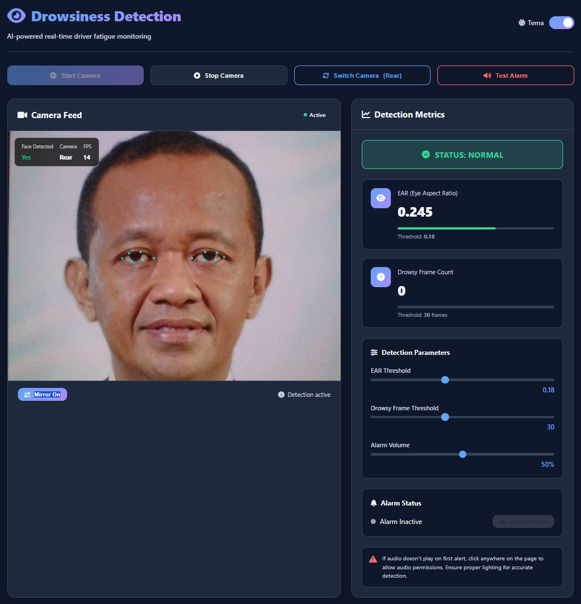

# Drowsiness Detection Web App

<div align="center">


**AI-powered real-time driver fatigue monitoring system that runs entirely in your browser**

[]()

</div>

## 📋 **Overview**

Drowsiness Detection Web App adalah solusi canggih untuk mendeteksi kelelahan dan kantuk secara real-time menggunakan teknologi **Computer Vision** dan **Artificial Intelligence**. Aplikasi ini bekerja sepenuhnya di browser pengguna tanpa memerlukan instalasi khusus atau server backend, menjaga privasi data dengan menjalankan semua pemrosesan secara lokal.

### 🎯 **Fitur Utama**

- ✅ **Deteksi Kantuk Real-time** - Menggunakan algoritma EAR (Eye Aspect Ratio)
- ✅ **100% Client-side** - Semua pemrosesan di browser, tanpa data dikirim ke server
- ✅ **Multi-kamera Support** - Switch antara kamera depan dan belakang
- ✅ **Tema Gelap/Terang** - Interface yang dapat disesuaikan
- ✅ **Parameter yang Dapat Dikustomisasi** - Threshold dapat diatur sesuai kebutuhan
- ✅ **Sistem Alarm Visual & Audio** - Peringatan dini saat terdeteksi kantuk
- ✅ **Mirror Mode** - Opsi untuk mencerminkan tampilan kamera
- ✅ **Indikator Real-time** - FPS, status wajah, dan metrik deteksi

## 🚀 **Cara Menggunakan**

### **Metode 1: Download dan Jalankan Lokal**
1. **Download** file ZIP dari repositori ini
2. **Ekstrak** file ZIP ke folder di komputer Anda
3. **Buka** file `index.html` di browser modern (Chrome, Firefox, Edge)
4. **Izinkan akses kamera** ketika diminta
5. **Klik "Start Camera"** untuk memulai deteksi

### **Metode 2: Hosting di Web Server**
1. **Upload** ketiga file (`index.html`, `styles.css`, `app.js`) ke web hosting Anda
2. **Akses** melalui URL yang sesuai (misal: `https://domain-anda.com/drowsiness-detection/`)
3. Pastikan server mendukung **HTTPS** (wajib untuk akses kamera di sebagian besar browser)

### **Metode 3: Gunakan Langsung (CDN)**
```html
https://asmarahancur.github.io/DrowsinessDetection/
```

## 🛠 **Teknologi yang Digunakan**

### **Core Technologies**
- **MediaPipe FaceMesh** - Library machine learning untuk deteksi landmark wajah
- **WebRTC** - Untuk akses kamera real-time
- **Web Audio API** - Untuk sistem alarm audio
- **Canvas API** - Untuk rendering video dan visualisasi
- **Modern CSS** - Dengan Grid, Flexbox, dan Custom Properties

### **Algoritma Deteksi**
Aplikasi menggunakan **EAR (Eye Aspect Ratio)** algorithm:
```
EAR = (‖p2 - p6‖ + ‖p3 - p5‖) / (2 × ‖p1 - p4‖)
```
- **EAR < Threshold** → Mata tertutup/turun
- **Consecutive Frames** → Deteksi kantuk jika melebihi frame threshold

## 📊 **Parameter yang Dapat Dikustomisasi**

### **1. EAR Threshold** (`0.10 - 0.30`)
- **Default**: 0.18
- **Fungsi**: Menentukan sensitivitas deteksi mata tertutup
- **Rekomendasi**: 0.15-0.20 untuk kondisi normal

### **2. Frame Threshold** (`10 - 60 frames`)
- **Default**: 30 frames
- **Fungsi**: Jumlah frame berturut-turut untuk konfirmasi kantuk
- **Rekomendasi**: 25-35 untuk mengurangi false positive

### **3. Alarm Volume** (`0 - 100%`)
- **Default**: 50%
- **Fungsi**: Mengatur volume alarm peringatan

## 🎮 **Fitur Kontrol**

### **Kontrol Kamera**
- **Start Camera**: Memulai streaming kamera dan deteksi
- **Stop Camera**: Menghentikan semua proses
- **Switch Camera**: Beralih antara kamera depan dan belakang
- **Mirror Mode**: Mengaktifkan/nonaktifkan efek cermin

### **Kontrol Deteksi**
- **Test Alarm**: Menguji sistem alarm audio
- **Silence Alarm**: Mematikan alarm yang aktif
- **Parameter Sliders**: Menyesuaikan threshold real-time

### **Interface Controls**
- **Theme Toggle**: Beralih antara tema gelap dan terang
- **Real-time Stats**: Menampilkan FPS, status kamera, dan deteksi wajah

## 🔧 **Persyaratan Sistem**

### **Browser Requirements**
- **Chrome 80+** (Rekomendasi)
- **Firefox 75+**
- **Edge 80+**
- **Safari 14+**
- **Browser mobile dengan dukungan WebRTC**

### **Hardware Requirements**
- **Kamera** (Built-in atau external)
- **Speaker/Audio Output** (untuk alarm)
- **Processor** Dual-core 1.5GHz+ (Rekomendasi)
- **RAM** 2GB+ untuk performa optimal

### **Software Requirements**
- **Web Browser Modern** dengan dukungan:
  - MediaStream API
  - Web Audio API
  - ES6+ JavaScript
  - CSS Grid/Flexbox

## 🏗 **Arsitektur Sistem**

```
┌─────────────────────────────────────────────────────────────┐
│                     User Browser                            │
├─────────────────────────────────────────────────────────────┤
│  ┌────────────┐  ┌────────────┐  ┌─────────────────────┐    │
│  │   HTML     │  │    CSS     │  │      JavaScript     │    │
│  │  Interface │  │   Styles   │  │   (Detection Logic) │    │
│  └────────────┘  └────────────┘  └─────────────────────┘    │
├─────────────────────────────────────────────────────────────┤
│  ┌──────────────────────────────────────────────────────┐   │
│  │               MediaPipe FaceMesh                     │   │
│  │          (via CDN - No Local Install)                │   │
│  └──────────────────────────────────────────────────────┘   │
├─────────────────────────────────────────────────────────────┤
│  ┌──────────────────────────────────────────────────────┐   │
│  │               WebRTC Camera Access                   │   │
│  └──────────────────────────────────────────────────────┘   │
└─────────────────────────────────────────────────────────────┘
```

## 🎯 **Kasus Penggunaan**

### **1. Pengemudi Kendaraan**
- **Deteksi kantuk** saat berkendara jarak jauh
- **Peringatan dini** sebelum microsleep terjadi
- **Monitoring** kondisi pengemudi real-time

### **2. Operator Mesin Berat**
- **Keamanan kerja** di lingkungan industri
- **Prevensi kecelakaan** akibat kelelahan
- **Compliance** dengan protokol keselamatan

### **3. Studi dan Penelitian**
- **Analisis pola kantuk** untuk penelitian
- **Pengujian algoritma** deteksi kelelahan
- **Edukasi** tentang bahaya mengemudi saat mengantuk

### **4. Penggunaan Personal**
- **Monitoring** saat bekerja larut malam
- **Alert system** untuk belajar/kerja marathon
- **Self-awareness** tentang kondisi kelelahan

## 📈 **Akurasi dan Performa**

### **Tingkat Akurasi**
- **Deteksi Wajah**: >95% dalam kondisi pencahayaan baik
- **EAR Calculation**: Akurasi floating-point tinggi
- **Response Time**: <100ms dari deteksi ke alarm

### **Optimasi Performa**
- **GPU Acceleration**: Menggunakan WebGL untuk rendering
- **Frame Skipping**: Optimasi untuk perangkat rendah spesifikasi
- **Memory Management**: Cleanup resources saat tidak digunakan

## 🔒 **Keamanan dan Privasi**

### **Privasi 100% Terjaga**
- ✅ **No Data Collection** - Tidak ada data yang dikirim ke server
- ✅ **Local Processing** - Semua pemrosesan di browser Anda
- ✅ **No Tracking** - Tidak ada analytics atau tracking
- ✅ **Camera Permission** - Hanya akses real-time, tidak disimpan

### **Security Features**
- **HTTPS Required** untuk akses kamera
- **Permission-based** access model
- **No persistent storage** dari video stream

## 🚨 **Peringatan dan Limitasi**

### **Batasan Teknis**
1. **Pencahayaan** - Performa menurun dalam kondisi gelap
2. **Posisi Wajah** - Deteksi optimal dengan wajah menghadap kamera
3. **Kacamata** - Mungkin mempengaruhi akurasi deteksi mata
4. **Frame Rate** - Bergantung pada kemampuan kamera dan CPU

### **Rekomendasi Penggunaan**
- Gunakan dalam **pencahayaan yang baik**
- Pastikan **wajah terlihat jelas** oleh kamera
- **Tes sistem** sebelum penggunaan kritis
- **Atur parameter** sesuai kondisi lingkungan

## 🔧 **Troubleshooting**

### **Masalah Umum dan Solusi**

| Masalah | Penyebab | Solusi |
|---------|----------|---------|
| Kamera tidak aktif | Izin belum diberikan | Klik "Allow" saat diminta izin kamera |
| Alarm tidak berbunyi | Browser audio policy | Klik sekali di halaman untuk mengaktifkan audio |
| Deteksi tidak akurat | Pencahayaan buruk | Perbaiki pencahayaan area |
| FPS rendah | Spesifikasi perangkat | Kurangi resolusi kamera |
| Switch camera gagal | Kamera tidak tersedia | Pastikan perangkat memiliki multiple cameras |

### **Debug Mode**
Tambahkan parameter berikut ke URL untuk debug:
```javascript
// Untuk logging detail
console.log('Debug mode aktif');

// Untuk memeriksa status
if (!navigator.mediaDevices) {
  alert('Browser tidak mendukung WebRTC');
}
```

## 📚 **API Reference (Internal)**

### **Fungsi Utama**
```javascript
// Inisialisasi sistem
initApp() → void

// Kontrol kamera
startCamera() → Promise<void>
stopCamera() → void
switchCamera() → Promise<void>

// Deteksi kantuk
computeEAR(landmarks, indices) → {ear: number, pts: Array}
updateEARDisplay(value) → void

// Sistem alarm
startAlarm() → void
stopAlarm() → void
testAlarm() → void
```

### **Event Listeners**
- `themeToggle` - Perubahan tema
- `earThresholdInput` - Adjust EAR threshold
- `frameThresholdInput` - Adjust frame threshold
- `alarmVolumeInput` - Adjust alarm volume

## 🌐 **Browser Compatibility**

| Browser | Status | Notes |
|---------|--------|-------|
| Chrome | ✅ Full Support | Versi 80+ |
| Firefox | ✅ Full Support | Versi 75+ |
| Edge | ✅ Full Support | Versi 80+ |
| Safari | ⚠️ Partial | Beberapa API limited |
| Opera | ✅ Full Support | Versi 67+ |
| Mobile Chrome | ✅ Full Support | Android 8+ |
| Mobile Safari | ⚠️ Partial | iOS 14.3+ |

## 📄 **Lisensi**

### **Lisensi Penggunaan**
Aplikasi ini tersedia di bawah lisensi **MIT License**, yang berarti:

- ✅ **Gratis digunakan** untuk tujuan komersial dan non-komersial
- ✅ **Dapat dimodifikasi** sesuai kebutuhan
- ✅ **Dapat didistribusikan** ulang
- ✅ **Tanpa garansi** - penggunaan atas risiko sendiri

### **Atribusi**
Jika menggunakan kode ini dalam proyek Anda, pertimbangkan untuk:
1. Memberi credit kepada pengembang asli
2. Menyertakan lisensi asli
3. Tidak menyatakan sebagai karya Anda sendiri

## 🤝 **Kontribusi**

### **Cara Berkontribusi**
1. **Fork** repositori ini
2. **Buat branch** untuk fitur baru (`git checkout -b feature/AmazingFeature`)
3. **Commit changes** (`git commit -m 'Add some AmazingFeature'`)
4. **Push ke branch** (`git push origin feature/AmazingFeature`)
5. **Buka Pull Request**

### **Area Pengembangan**
- [ ] Machine Learning model improvement
- [ ] Additional detection metrics (yawn detection, head pose)
- [ ] Multi-language support
- [ ] Export data functionality
- [ ] Mobile app version

## 📞 **Dukungan dan Kontak**

### **Bantuan Teknis**
Jika mengalami masalah:
1. **Cek Troubleshooting** section di atas
2. **Verifikasi** persyaratan sistem
3. **Test** di browser berbeda
4. **Clear cache** dan coba lagi

### **Pelaporan Bug**
Laporkan bug dengan menyertakan:
1. **Browser** dan versi
2. **Sistem Operasi**
3. **Steps to reproduce**
4. **Screenshot** jika memungkinkan

## 📈 **Roadmap Pengembangan**

### **Versi 2.1 (Q2 2024)**
- [ ] Multi-wajah detection
- [ ] Export laporan PDF
- [ ] Cloud sync (opsional)
- [ ] Advanced analytics dashboard

### **Versi 2.5 (Q3 2024)**
- [ ] Mobile-responsive enhancements
- [ ] Offline mode support
- [ ] Additional language support
- [ ] Plugin system for extensions

### **Versi 3.0 (Q4 2024)**
- [ ] AI model customization
- [ ] Real-time collaboration
- [ ] API for third-party integration
- [ ] Enterprise features

## 🎓 **Referensi Teknis**

### **Paper dan Research**
1. **Real-Time Eye Blink Detection using Facial Landmarks** - Soukupová & Čech, 2016
2. **Drowsiness Detection System** - IEEE Transactions on Intelligent Transportation Systems
3. **MediaPipe Face Mesh** - Google Research, 2020

### **Standar Industri**
- **ISO 26262** - Functional safety for road vehicles
- **NHTSA Guidelines** - Driver distraction and fatigue
- **EU General Safety Regulation** - Vehicle safety standards

---

<div align="center">

## **⚠️ Peringatan Penting**

Alat ini adalah **sistem bantu (assistive system)** dan **bukan pengganti** perhatian pengemudi. Selalu utamakan keselamatan dengan beristirahat yang cukup sebelum berkendara.

**Developed with ❤️ for safer roads**

*Terakhir diperbarui: April 2024*

</div>
